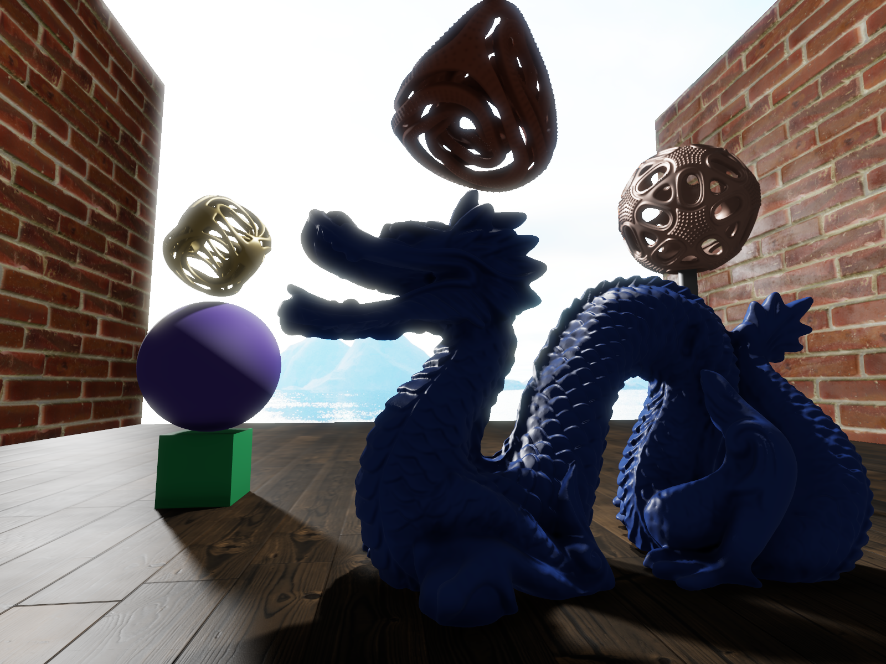
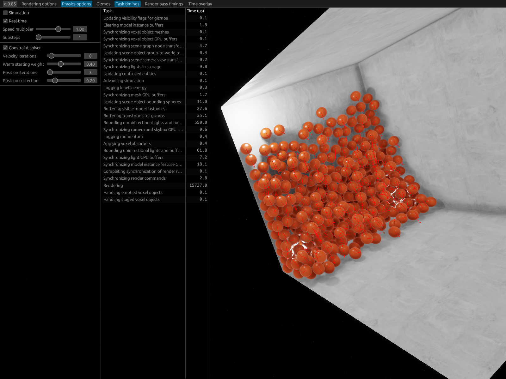

# Impact

This is a highly experimental and work-in-progress game engine written in Rust. It is by no means featured enough for building games yet (except for very boring ones).

## Features

### Graphics

The engine does physically based 3D rendering. The graphics system is built on [`wgpu`](https://github.com/gfx-rs/wgpu). Notable graphics capabilities include:

- A general microfacet material model.
- Area lights with soft shadows.
- Normal mapping and parallax mapping.
- Ambient lighting and ambient occlusion.
- Fully HDR rendering with bloom, automatic exposure and tone mapping.
- Temporal anti-aliasing.

### Physics

- Full rigid body dynamics for objects of any shape.
- Various force and torque generators.
- A drag model that computes both forces and torques for objects of any shape.
- Collision resolution and constraint solving using sequential impulses.

### Voxels

Voxel based objects have first-class support. The shape of these objects are defined by signed distance fields, which combined with Surface Nets-based meshing gives them a smooth appearance. An object can be comprised of voxels with many different materials, which are smoothly blended between during rendering. The objects can also be arbitrarily deformed or split up, which dynamically affects their physical behavior. See the video below for a demonstration.

### SDF generation

The engine includes a graph‑based system for procedurally generating signed distance fields (SDFs), which are used to define the shape of voxel objects. Each node in an SDF graph represents a simple operation, such as creating a primitive shape (sphere, capsule, box), applying a geometric transformation, adding gradient noise, or combining fields using smooth Boolean operators.

In most cases, SDF graphs are not authored directly. Instead, they are generated from higher‑level *meta graphs*. Meta nodes provide more convenient and expressive building blocks, like creating multiple instances of a shape, arranging them in structured patterns (grids, sphere surfaces), or modifying shapes based on other fields (for example snapping to a surface or aligning to a gradient). Most node parameters can be randomized using different distributions, and parameters can also depend on each other.

A visual editor is available for creating and editing graphs while viewing the results in real time. One of the videos below shows how the editor can be used to generate asteroids with crater distributions informed by real physical processes and empiric measurements.

### ECS

The engine uses its own Entity-Component-System (ECS) implementation, which also serves as the main public API.

### Scripting

There is currently limited scripting support using the [Roc](https://www.roc-lang.org/) language. Roc is a very young language, but it shows great promise both for standalone applications and, thanks to its [platform](https://www.roc-lang.org/platforms) concept, for being embedded into larger systems. Since it compiles to machine code, it has the potential to be a very performant scripting language. The [How applications work](#how-applications-work) section describes how Roc is embedded into the Impact engine. At the moment, Roc scripts are mainly responsible for scene setup and input handling.

### GUI

The engine currently has a simple [`egui`](https://github.com/emilk/egui)-driven development GUI.

## Showcase







## Running the engine

### Requirements

- Rust (https://rustup.rs)
- Roc (https://roc-lang.org/install/) for scripting. Applications do not have to use Roc, but the existing applications do.
- Make, if you want to use the Makefiles.

### Things to try

Existing applications can be found in the `apps` directory.

To try the SDF graph editor shown in the video above, navigate to the `apps/voxel_generator` directory and run `make run`. The graph created in the video can be loaded from the `voxel_generator/examples` directory.

The `basic_app` application has a handful of simple scenes and physics experiments that can be switched between by editing `main.roc` in the `basic_app/scripts` directory. However, most of the scenes assume certain textures and meshes to be available, and those are not included in this repo. The `VoxelBoxTumber` scene used by default does not require any assets, and can be tried out by running `make run CONFIG_FILE=config/config_no_assets.ron` in the `apps/basic_app` directory.

## Planned features

- N-body gravity simulation.
- Voxel object fracturing.
- Procedural system for assigning materials to voxels.
- Expanded scripting capabilities.
- Expanded GUI.
- Better asset management.
- Audio.
- Let's see when we get here...

Once the engine has the sufficient features, a game will be developed in parallel with the engine. 

## How applications work

An Impact application has three components: the Rust application crate, the Roc platform and the Roc script.

**The application crate**

This contains all application-specific functionality outside of scripting. It links statically with the engine crate and together they form a shared library. This shared library is dynamically loaded by the Roc platform at runtime.

The app crate exposes a scripting API via FFI – this provides operations like creating entities or executing engine commands. It also expects certain Roc callbacks (for tasks like scene setup and input handling) to be implemented by the script, which it calls via dynamically loaded FFI functions.

**The Roc platform**

The Roc platform consists of a small Rust crate and a Roc package.

- The **platform crate** is compiled as a static library and linked into the Roc script. It forwards API calls from the script to the application+engine shared library, which it loads at runtime using dynamic linking. It also provides the required low-level functions for Roc's runtime (e.g., memory allocation and I/O).

- The **platform Roc package** defines the Roc-side API for interacting with the engine. It provides ergonomic wrappers around raw FFI functions and declares the callback interface that the app crate expects Roc scripts to implement.

**The Roc script**

This is a standard Roc application that imports the platform package. But rather than having a `main` function, it implements the callback functions required by the platform, and during the execution of these functions it uses the scripting API to modify the application and engine state. When compiled, the script is statically linked with the platform crate, producing a shared library that the application crate can load and interact with.

## Data transfer between Rust and Roc

In order for the Roc script to interact with the engine, the Roc counterparts of many types defined in the engine, like ECS components and command enums, must be available to the script. Rust structs and enums can typically be directly translated to Roc records and tag unions. The engine has a procedural macro that allows this to be done automatically, which it applies to all types requiring a Roc counterpart.

Although these types will have semantically identical Rust and Roc versions, their binary representations will in general differ between Rust and Roc. Even if Roc could, like Rust, be coerced to use the C ABI, that wouldn't apply to all relevant types (like enums with payloads).

To handle this, the engine generates code for serializing the types to a common format before passing them across the FFI boundary, and for deserializing them on the other side. This format is a simple extension of the C ABI, so for structs with `repr(C)`, which includes all components, the (de)serialization involves no work on the Rust side.

## Scripting API

The following Roc snippets show the scripting API in action.

Here is how the laser beam in the video above was created in the script's `setup_scene!` callback.

```roc
Entity.new_component_data
    |> Setup.Parent.add_new(entity_ids.player)
    |> Comp.ReferenceFrame.add_new(
        (0.15, -0.3, 0.0),
        UnitQuaternion.from_axis_angle(UnitVector3.x_axis, (-Num.pi) / 2),
    )
    |> Setup.CylinderMesh.add_new(100, 0.02, 16)
    |> Setup.UniformColor.add((0.9, 0.05, 0.05))
    |> Setup.UniformEmissiveLuminance.add(1e6)
    |> Comp.VoxelAbsorbingCapsule.add_new(Vector3.same(0), (0, 100, 0), 0.3, 200)
    |> Comp.SceneEntityFlags.add(
        Comp.SceneEntityFlags.union(
          Comp.SceneEntityFlags.is_disabled,
          Comp.SceneEntityFlags.casts_no_shadows,
        ),
    )
    |> Entity.create_with_id!(entity_ids.laser)?
```

Here is how the beam was enabled in the script's `handle_mouse_button_event!` callback when clicking the mouse.

```roc
entity_id = entity_ids.laser

state =
    when button_state is
        Pressed -> Enabled
        Released -> Disabled

Command.execute!(Engine(Scene(SetSceneEntityActiveState({ entity_id, state }))))
```

Here is an example of how entities can be created in batch (these are the red balls in one of the screenshots).

```roc
Entity.new_multi_component_data(List.len(positions))
    |> Setup.SphereMesh.add_multiple_new(
        Same(100),
    )?
    |> Comp.ModelTransform.add_multiple_with_scale(
        Same(Num.to_f32(2 * radius)),
    )?
    |> Comp.ReferenceFrame.add_multiple_unoriented(
        All(positions),
    )?
    |> Comp.Motion.add_multiple_stationary
    |> Setup.DynamicRigidBodySubstance.add_multiple(
        Same({ mass_density: 1.0 }),
    )?
    |> Setup.SphericalCollidable.add_multiple_new(
        Same(Dynamic),
        Same(Sphere.new(Point3.origin, radius)),
        Same(Physics.ContactResponseParameters.new(0.7, 0.5, 0.3)),
    )?
    |> Setup.ConstantAcceleration.add_multiple_earth
    |> Setup.TexturedColor.add_multiple(
        Same(texture_ids.color),
    )?
    |> Setup.UniformSpecularReflectance.add_multiple_in_range_of(
        Same(Setup.UniformSpecularReflectance.plastic),
        Same(0),
    )?
    |> Setup.TexturedRoughness.add_multiple_unscaled(
        Same(texture_ids.roughness),
    )?
    |> Setup.NormalMap.add_multiple(
        Same(texture_ids.normal),
    )?
    |> Setup.PlanarTextureProjection.add_multiple_for_rectangle(
        Same(Setup.RectangleMesh.unit_square),
        Same(0.2),
        Same(0.2),
    )?
    |> Entity.create_multiple!?
```
