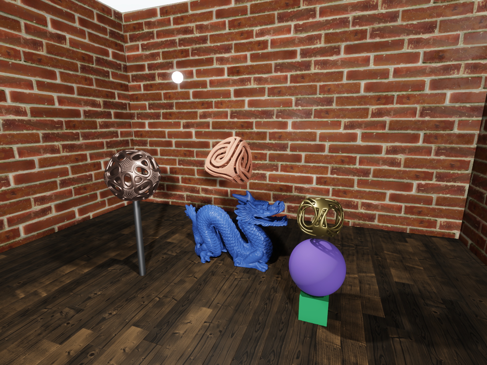

# Impact

This is a highly experimental and work-in-progress game engine written in Rust. It is by no means featured enough for building games yet (except for very boring ones).

## Features

### Graphics

The engine does physically based 3D rendering. The graphics system is built on [`wgpu`](https://github.com/gfx-rs/wgpu). Notable graphics capabilities include:

- A general microfacet material model.
- Area lights with soft shadows.
- Normal mapping and parallax mapping.
- Ambient lighting and ambient occlusion.
- Fully HDR rendering with bloom, automatic exposure and tone mapping.
- Temporal anti-aliasing.

### Physics

- Various integration schemes for motion (including 4'th order Runge-Kutta).
- Full rigid body dynamics for objects of any shape.
- Various force and torque generators.
- A relatively sophisticated drag model that computes both forces and torques for objects of any shape.

### Voxels

Voxel based objects have first-class support. The shape of these objects are defined by signed distance fields, which combined with Surface Nets-based meshing gives them a smooth appearance. An object can be comprised of voxels with many different materials, which are smoothly blended between during rendering. The objects can also be arbitrarily deformed or split up, which dynamically affects their physical behavior. See the video below for a demonstration.

### ECS

The engine uses its own Entity-Component-System (ECS) implementation, which also serves as the main public API.

## Planned features

In rough order of priority (which may change):

- Collision detection and resolution.
- N-body gravity simulation.
- Procedural voxel generation.
- Scripting (using [Roc](https://www.roc-lang.org/), if possible).
- 2D rendering for GUI.
- Audio.
- Let's see when we get here...

## Showcase

